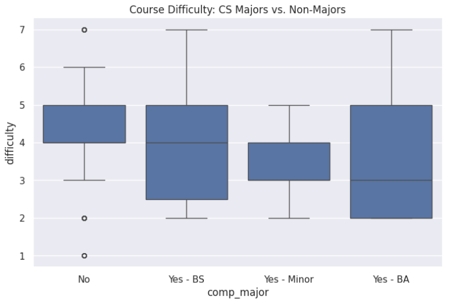
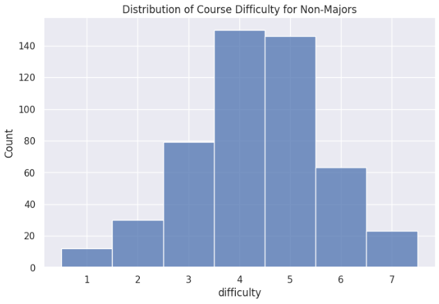
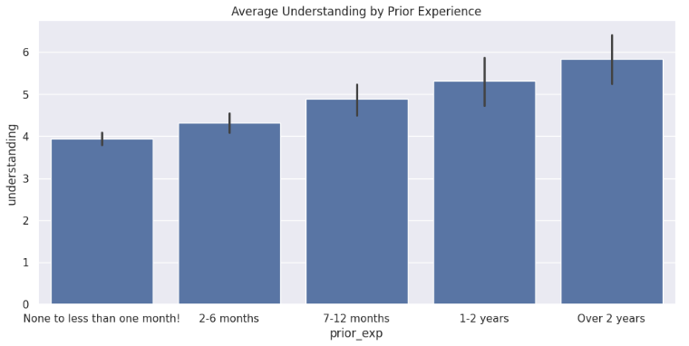

# EX09: Data Analysis

### My Analysis
I analyzed non-majors vs majors to see who needs more help.

### Charts

### Conclusion
Based on the data analysis, my idea to add targeted review sessions for non-CS majors is definitely supported.

First off, the count function revealed a massive detail: there are 503 non-majors in this dataset compared to only about 30 people intending to major or minor in CS. Furthermore, my bar chart clearly proves that students with "None to less than one month" of prior experience report the lowest average understanding of the material. Because the class is overwhelmingly made up of non-majors (who likely make up the bulk of the beginners), giving them targeted support is completely justified. The histogram shows most non-majors rate the difficulty at a 4 or 5, so they are surviving, but they could definitely use a boost.

Refinements/Extensions: Instead of just calling them "Non-Major Reviews," it might be better to brand them as "Zero-Experience Bootcamps" or "Beginner Basics." That way, it targets the actual root of the problem (lack of prior experience) rather than just what their major is.

Costs and Trade-offs: The biggest cost here is paying TAs or instructors for the extra hours required to plan and host these extra sessions. A trade-off is that students are already busy, so adding more optional sessions might just stress out the students who don't have time to attend them. Also, the university would have to find open lecture halls to host these extra sessions.